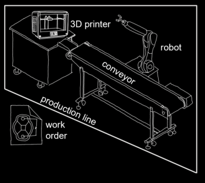

# Azure Digital Twins 
## Companion Source Code - windows.developer 8.2021 / 9.2021

### Purpose
A simple c# application to demonstrate basic Azure Digital Twins functionality. Companion material for an article published in [windows.developer magazine](https://entwickler.de/magazine-ebooks/windows-developer/windows-developer-82021)

### Content
Program.cs demonstrates: 
- Authorization with Azure Digital Twins Instance
- Upload Model Definition
- Create Digital Twin
- Send of Telemetry Data
- Patch Twin Property
- Query Azure Digital Twins Instance
- Create Twin Relationship

Folder ./Models contains DTDL definition of: 

- Conveyor Belt
- 3D-Printer
- Production Asset
- Production Line
- Robot 
- Production Order

